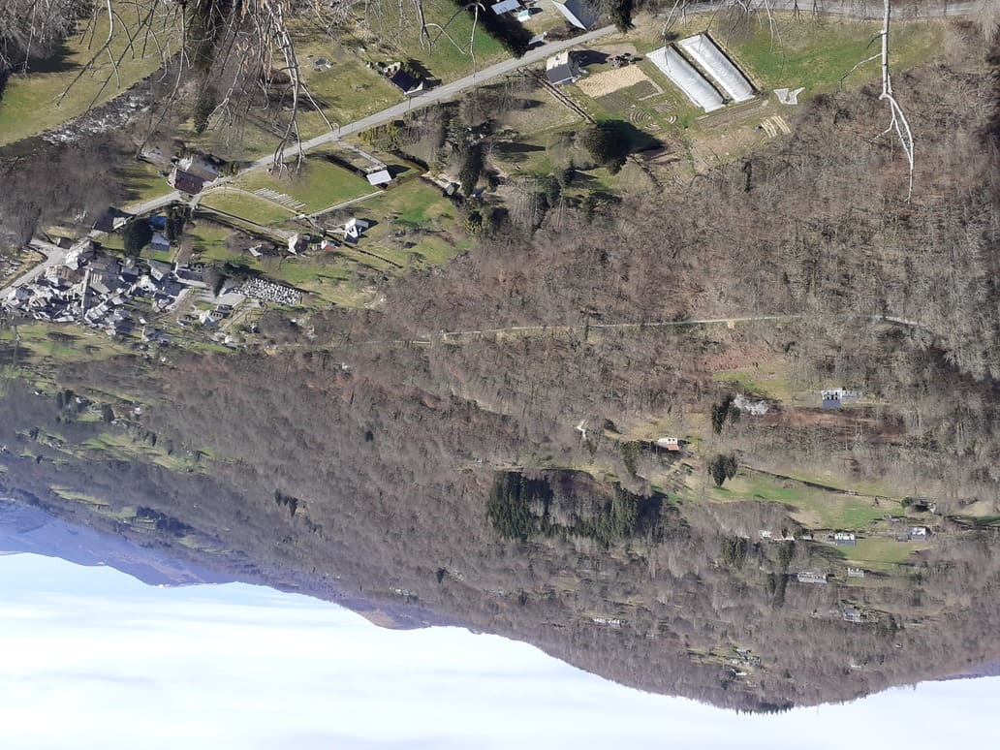
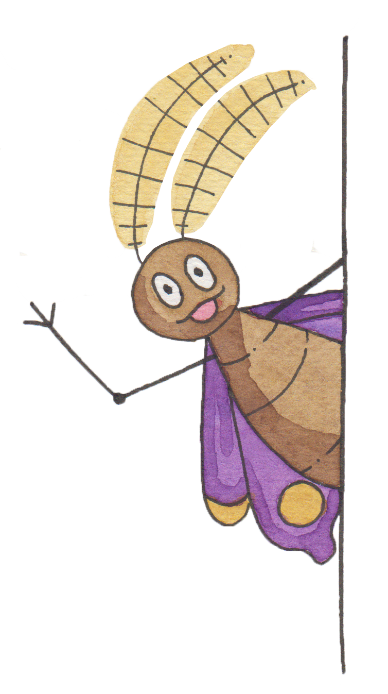
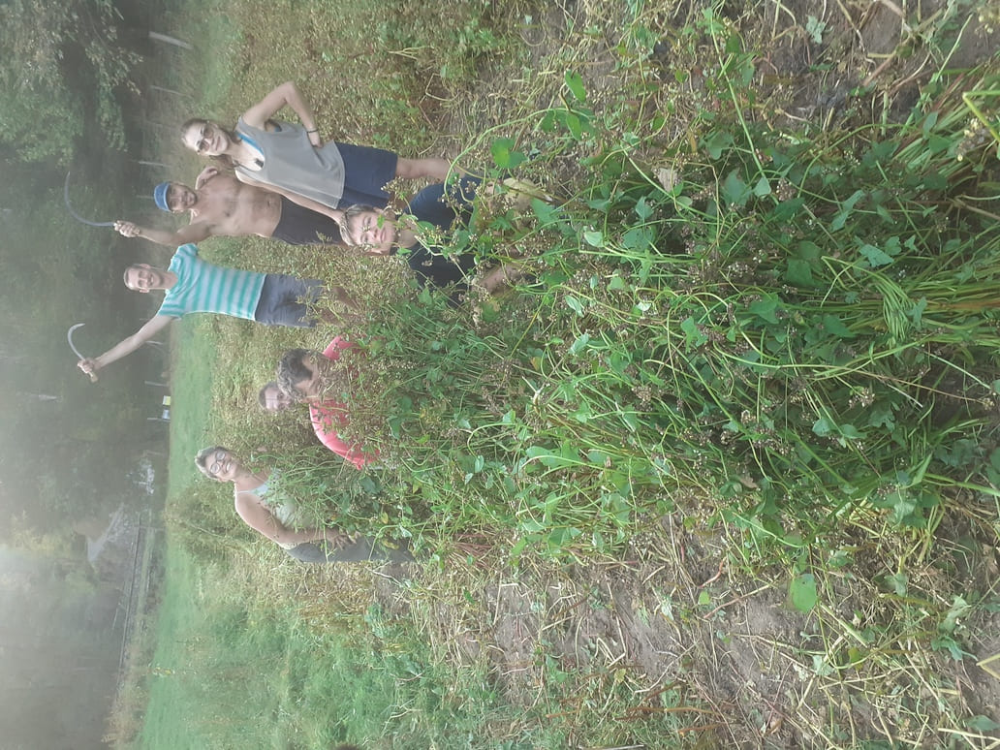
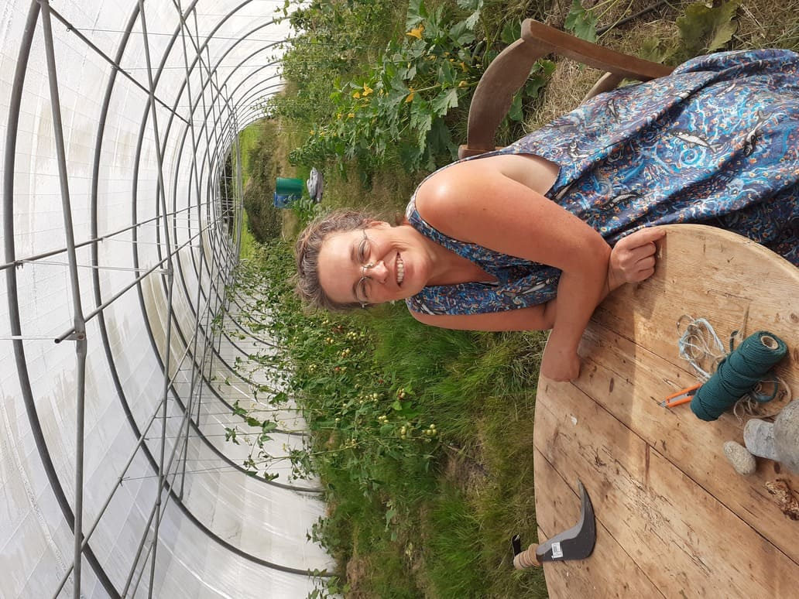
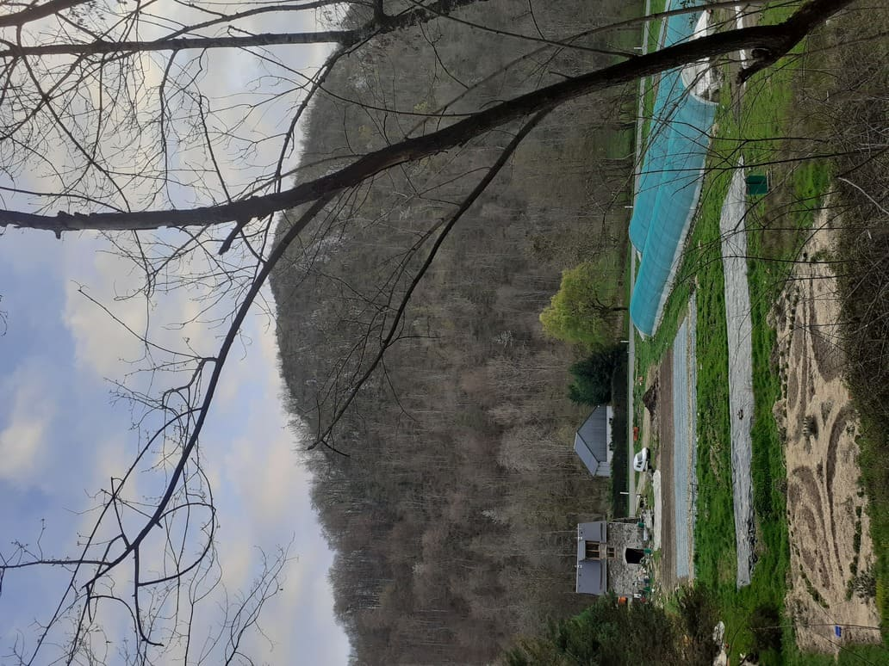

## Une ferme dédiée à l'autonmie alimentaire de la vallée de l'Arac
Au coeur des Pyrénées, dans le Parc Régional du Couserans, on ne cesse pas de continuer à rêver!

## Circuit très très court
la Ferme des Légumes et des Rêves n’est pas médecin de famille mais se veut Ferme de Famille. 
Elle est dédiée aux habitants de la vallée. Consommer local c’est participer au vaste élan mondial pour rendre les peuples souverains de leur alimentation et affaiblir le ténia de la finance internationale. Chaque euro dépensé en circuit court participe à la construction du paradis local dans lequel nous vivons et non d’un paradis fiscal dans lequel nous ne vivons pas (eh oui, la grande distribution agro-alimentaire c’est aussi la grande exaction des richesses de tous au profit de quelques uns).

la Ferme des Légumes et des Rêves commercialise tous ses produits à moins de 10 km :
- pour la cantine des écoles à Massat
- dans les 3 épiceries de la vallée : les 7 vallées à Massat-magasin bio, l’EPI- épicerie particiative de produits locaux à Castet d’Aleu, l’Espies gourmand à Boussenac
- Sur le marché de Massat les jeudis et dimanches et le marché de Biert les mercredis d’été.
- chez les restaurateurs de la vallée : la pizzeria de l’Oumbas, le Globe, le traiteur de Massat, le Garland, Pique-la-frite
- en direct à la Ferme des Légumes et des Rêves et en livraison à domicile.

---

## Automonie énergétique 
La Ferme des Légumes et des Rêves et ses habitants ne sont raccordés au réseau ni en eau ni en électricité : elle se veut un exemple de sobriété énergétique et d’impact minimum sur l’environnement.
Eco-rénovation avec isolation en terre et paille du terrain, partage de l’habitat, chauffage au bois du lieu, eau de source, éclairage 12v pour un minimum de panneaux solaires, partage du tracteur et des voitures, toilettes sèches et bains de rivière…

---

## Autonomie alimentaire 
Ne nous leurrons pas, les légumes c’est délicieux mais actuellement sur terre, 75 % de l’alimentation humaine serait des céréales. Les anciens de la vallée ont été témoins des cultures de blé, de seigle, de sarrasin, de maïs. Bien sûr, il y avait10 fois plus de bras qu’aujourd’hui et pas de taxes sur le travail, mais tous ensemble nous pouvons le faire.
la Ferme des Légumes et des Rêves lance une grande collecte citoyenne de fonds pour acheter une mini-moissonneuse batteuse. Nous pourrons ainsi récolter toutes les céréales mais aussi les légumineuses comme les lentilles, les haricots secs et les même le colza pour l’huile. 

---

## Engagement politique
La ferme est syndiquée à la Confédération Paysanne pour soutenir le maintien de la paysannerie, de l’autonomie alimentaire en France et dans le monde. Avec la municipalité de Biert, l’Inrae ( Institut National de Recherche pour l’Agriculture, l’Alimentation et l’Environnement) et le Parc Régional Naturel du Couserans, la ferme s’engage dans une vaste aventure pour réellement construire la vallée de demain. L’inrae en a d’ailleurs fait un magnifique film «Demain, la vallée» qui commence à tourner dans les salles. La ferme accueille également l’opération Salon à la ferme: un contre-salon de l’agriculture festif dans des centaines de fermes de France, dont la Ferme des Légumes et des Rêves!

---

## Engagement écologique paysan
Permacultrice diplômée mais aussi exploratrice de l’agroforesterie, du maraîchage sur sol vivant, de la biodynamie, Hélène Decarpignies, la fondatrice de la la Ferme des Légumes et des Rêves a choisi de cultiver bio. Bien sûr, c’est pour aller plus loin que le bio abusif des firmes internationales mais en rendant quand même hommage à un demi-siècle de sensibilisation sans relâche aux abus de la révolution verte, à la demande de transparence sur les intrants, les ogm, les pesticides homicides. A l’heure des grands retours en arrière, de la main basse inexorable des plus riches sur les richesses générées par les plus pauvres, ici on continue à rêver bio-local-éthique. 

---

## La culture avec et sans les bottes

La fondatrice de la Ferme des Légumes et des Rêves, Hélène Decarpignies, fut artiste lyrique professionnelle dans une autre vie. Chaque occasion est bonne pour elle de mêler le champs et le chant : tous ses légumes sont nourris de mantras (chants sacrés) et airs d’opéra !
A lla Ferme des Légumes et des Rêves, la Culture aussi est en circuit très court :
-benregistrement en disque du répertoire traditionnel de Massat avec les habitants de la vallée
- stages de techniques vocales auxquels ont déjà participé presque 200 chanteurs locaux
- ateliers Mozararac (pour se délecter du le grand Mozart au détour de textes écrits par les habitants en hommage à l’Arac, la rivière de la vallée)
- ateliers Hildegard von Bingen (pour chanter le répertoire écrit au 12ème siècle par cette illustre médium botaniste)
- bals trads avec le collectif Massat trad
- organisation du grand stage choral et randonnée « Massat Musique Montagene qui a lieu chaque été la 2ème quinzaine de juillet
- récitals lyriques chez l’habitant
- participation à l’organisation des Festivals estivaux du Fleb -Festival Les Essentielles de Boussenac, et des « Mercredis sur la place » de Biert.

---

## Faire corps avec la montagne
Il faut être amoureux-se de la montagne et de cette vallée retirée pour s’y établir durablement.
 Quel bonheur de se noyer dans la nature, de sillonner ses crêtes qui rendent l’humain si dérisoire, de se diluer dans les eaux chargées du patrimoine géologique exceptionnel de ce lieu, de sentir à travers ses pieds la force tellurique des profondeurs de la terre offerte miraculeusement au ciel par la tectonique des plaques!
La Ferme des Légumes et des Rêves est heureuse de mettre dans votre assiette la force régénératrice des montagnes, ses parfums si uniques, ce lien indescriptible qui nous incarne ici et maintenant, cette source de sens profond, de plaisir et de joie.

---

## Inspirer

Idéalement située pour communiquer, en tête de proue de l’entrée ouest de la vallée, la Ferme des Légumes et des Rêves est consciente de son rôle à jouer comme espace de communication très visuel.
Elle se veut un lieu inspirant et engagé vers des idéaux de gratitude envers le vivant et valorisation de la part belle de l’humain.
L’accès au foncier pour les nouvelles générations est un problème réel, aussi bien pour l’habitat que les terres agricoles. La Ferme des Légumes et des Rêves met les voiles vers :
- la sortie de la spéculation: rénover la ferme pour qu’elle puisse servir d’habitat à plusieurs personnes œuvrant au projet global afin que chacun puisse y entrer et en sortir facilement en revendant sa part à un prix accessible.
- la participation active à l’évolution de la vallée vers un territoire capable d’inspirer les autres territoires en terme de prospérité alimentaire, de sobriété heureuse, de mixité sociale, de dynamique collective citoyenne joyeuse.

---

## Envie de participer à l’aventure?

Quel meilleur outils pour construire la vie que de faire de nos rêves des réalités ? A travers la Ferme des Légumes et des Rêves, peut-etre pourrez vous réaliser les vôtres.
La Ferme des Légumes et des Rêves peut accueillir stagiaire, woofeur-euse, petits coups de main lors de chantiers participatifs ou tout au long de l’année. Il y a aussi une cagnotte en ligne pour nous soutenir financièrement.  
  
